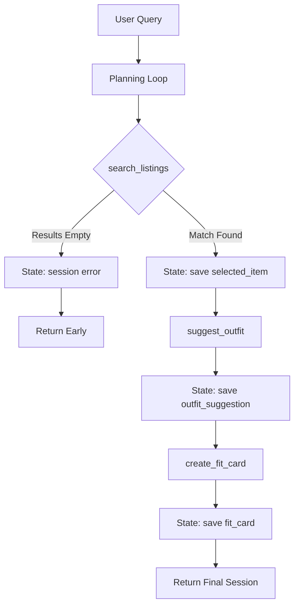

# FitFindr — planning.md

## Tools

### Tool 1: search_listings

**What it does:**
Searches the mock listings JSON dataset for secondhand items that match the user's specific criteria.

**Input parameters:**
- `description` (str): The style, brand, or keywords of the item being searched for.
- `size` (str): The specific clothing size requested (e.g., "M", "L").
- `max_price` (float): The absolute maximum price the user is willing to spend.

**What it returns:**
A list of dictionaries. Each dictionary represents a matching listing and contains fields like `id`, `title`, `description`, `price`, and `brand`.

**What happens if it fails or returns nothing:**
If no listings match the exact filters, it returns an empty list `[]`. The agent catches this empty list, terminates the sequence early, and informs the user to try dropping the size filter or raising their budget.

---

### Tool 2: suggest_outfit

**What it does:**
Analyzes the newly retrieved item alongside the user's existing wardrobe to generate personalized styling advice.

**Input parameters:**
- `new_item` (dict): The dictionary of the single clothing item selected from the search results.
- `wardrobe` (dict): The dictionary representing the user's current closet contents.

**What it returns:**
A text string containing 2–3 sentences of actionable styling advice, explaining how to pair the new item with what the user already owns.

**What happens if it fails or returns nothing:**
If the `wardrobe` dictionary is empty, the tool does not crash. Instead, it falls back to suggesting universal style staples (like plain denim or white sneakers) to ensure the user still gets a complete outfit idea.

---

### Tool 3: create_fit_card

**What it does:**
Translates the detailed styling advice into a short, punchy, shareable description suited for a social media caption.

**Input parameters:**
- `outfit` (str): The styling paragraph generated by the `suggest_outfit` tool.
- `new_item` (dict): The dictionary of the selected item, used to pull in details like price and brand.

**What it returns:**
A short text string formatted like an Instagram or TikTok caption, complete with emojis.

**What happens if it fails or returns nothing:**
If the `outfit` string is somehow missing or empty, it outputs a safe fallback string that just highlights the item itself without styling advice.

---

### Additional Tools (if any)

None.

---

## Planning Loop

**How does your agent decide which tool to call next?**
The agent uses sequential, conditional logic based entirely on the output of the first tool. It always initiates by running `search_listings`. It then checks the length of the `results` list. If the list is empty, it sets an error message and returns the session immediately without calling the next two tools. If the list is populated, it assigns `results[0]` to the session state and proceeds to call `suggest_outfit`, followed immediately by `create_fit_card`. It knows it is done when the fit card string is successfully generated and saved to the session.

---

## State Management

**How does information from one tool get passed to the next?**
Information is passed using a central `session` dictionary that persists throughout the run. When `search_listings` succeeds, the top item is saved to `session["selected_item"]`. The next tool, `suggest_outfit`, pulls its inputs directly from `session["selected_item"]` and `session["wardrobe"]`. The resulting advice is saved to `session["outfit_suggestion"]`, which the final tool then reads to generate the caption.

---

## Error Handling

| Tool | Failure mode | Agent response |
|------|-------------|----------------|
| search_listings | No results match the query | Sets an error in the session state and returns immediately, telling the user to adjust their price or size filters. |
| suggest_outfit | Wardrobe is empty | Generates an outfit using universal basic items (like plain jeans) instead of crashing. |
| create_fit_card | Outfit input is missing or incomplete | Skips the styling advice and generates a simple caption highlighting just the item's price and brand. |

---

## Architecture

---

## AI Tool Plan

**Milestone 3 — Individual tool implementations:**
I will use Claude 3.5 Sonnet. I will copy my search_listings spec (inputs, return values, failure mode) and ask it to write the Python function using the load_listings() helper. Before running the code, I will manually inspect it to ensure it does not throw an exception when the list is empty. I will then test it against 3 hardcoded queries in the terminal.

**Milestone 4 — Planning loop and state management:**
I will use Claude 3.5 Sonnet. I will provide my Mermaid architecture diagram and my specific Planning Loop logic description. I expect it to generate the run_agent() function. I will verify the code by ensuring there is an explicit `if not results:` branch that prevents the LLM tools from being called when the search fails.

---

## A Complete Interaction (Step by Step)

**Example user query:** "I'm looking for a vintage graphic tee under $30. I mostly wear baggy jeans and chunky sneakers. What's out there and how would I style it?"

**Step 1:**
The agent parses the query and calls `search_listings(description="vintage graphic tee", size=None, max_price=30.0)`. It finds a match and saves the dictionary for a "$22 Faded Band Tee" to `session["selected_item"]`.

**Step 2:**
The agent checks that an item was found, so it proceeds to call `suggest_outfit(selected_item, wardrobe)`. The LLM generates a styling paragraph suggesting the user tuck the band tee into their baggy jeans. This string is saved to `session["outfit_suggestion"]`.

**Step 3:**
The agent calls `create_fit_card(outfit_suggestion, selected_item)`. The LLM generates a short, emoji-filled caption about the $22 find and the baggy jeans combo. This is saved to `session["fit_card"]`.

**Final output to user:**
The user interface displays the selected item details, the styling paragraph, and the final shareable social media caption.